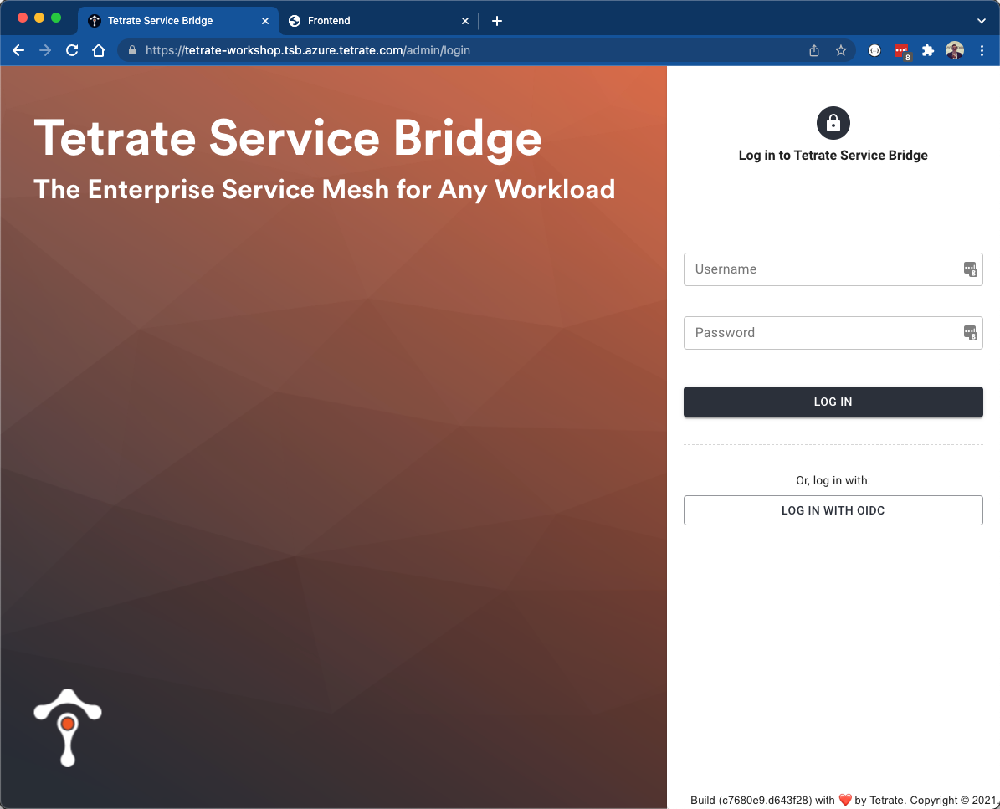
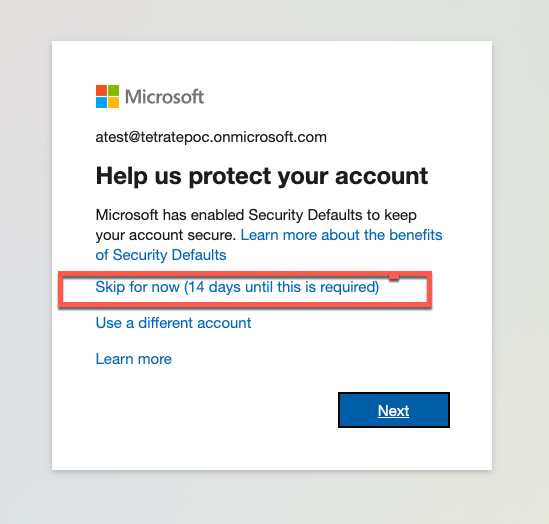

# Overview
Throughout the labs contained within this workshop we will be interacting with the environment through 3 primary ways:
1. TSB via a browser
2. TSB via tctl cli
3. Kubernetes via kubectl

## Accessing TSB Via Web Browser
TSB can be accessed in a browser at: [https://workshop.poc-tsb.azure.tetrate.com/admin/login](https://tetrate-workshop.tsb.azure.tetrate.com/admin/login)  You will utilize an Azure AD account that has been provisioned for you.  By selecting `Log In With OICD` you will be redirected to Azure to authenticate.  Utilize the username/password that has been provided to you.  It should be in the form of `<FIRST_INITIAL><LAST_NAME>@tetratepoc.onmicrosoft.com`



When you log in you may be asked to install a Multi-factor Auth app.  If so, select "Skip For Now".



## Accessing TSB Via TCTL CLI
For a large part of the hands-on labs we will be interacting with TSB via API calls.  These are most easily invoked via the `tctl` CLI.  This has already been installed on the jumpbox.  Login using the following command, which will prompt you to authenticate with Azure AZ.  Utilize the username/password that has been provided to you.  It should be in the form of `<FIRST_INITIAL><LAST_NAME>@tetratepoc.onmicrosoft.com`.  Follow the prompts to confirm that you are logging in the applicatin `Tetrate-Workshop`.

```bash
tctl config clusters set default --bridge-address $TSB_HOST
tctl login --use-device-code # Follow directions to authenticate in browser
tctl get tenants  # This is a quick validation that we were successful
```

During initialization a config file will be created `~/.config/tetrate/tctl/tctl_config` containing the TSB endpoint and your authorization token used for API calls.  

## Accessing Kubernetes via Kubectl CLI
At times we will need to deploy applications or configuration (e.g. a service account or namespace) directly to kubernetes.  Your jumpbox has been configured with a valid kubeconfig so that the `kubectl` CLI can be used.  As a refresher, the target environment is comprised of 4 Kubernetes clusters:
- 2 clusters in `Cloud A`.  The kubeconfig contains these configured as `cloud-a-01` and `cloud-a-02`.
- 1 cluster in `Cloud B`.  The kubeconfig contains this configured as `cloud-b-01`.
- 1 cluster deployed and configured as a Tier 1 Gateway. The kubeconfig contains this configured as `tier1`.

```bash
kubectx
```

In most `kubectl` commands the `--context` flag will be used to target a specific cluster.  For example:

```bash
kubectl --context cloud-a-01 get ns -L istio-injection  
```

## Misc Environment Information
For many of the CLI commands, both `kubectl` and `tctl`, a preset environment variable will be utilized named `PREFIX`.  This is a prefix that will be prepended to some of the Tetrate and Kubernetes objects that must be uniquely named, such as a kubernetes namespace or an externally routable DNS entry.  This ensures that within this multi-tenant environment participants do not step on each others toes, so to speak. 

```bash
echo Workshop environment PREFIX: $PREFIX
```

Additionally, all commands should b executed with a shell context of `/home/ec2-user/workshop-101`.  Made sure you CD into that directory:

```bash
cd workshop-101/
```


When executing the CLI commands, which typically accept YAML as an input, we will use the linux command `envsubst` to replace references to `$PREFIX` with the value that is unique to your env.  Test this out:

```bash
echo "File without variable substitution:"
cat 00-env-access/01-test.yaml
echo "File WITH variable substitution:"
envsubst < 00-env-access/01-test.yaml
```

You should see an output similar to the following, except your prefix will be different:
```bash
File without variable substitution:
---
apiVersion: v1
kind: Namespace
metadata:
  name: $PREFIX-replace-test
File WITH variable substitution:
---
apiVersion: v1
kind: Namespace
metadata:
  name: adamz-replace-test
```