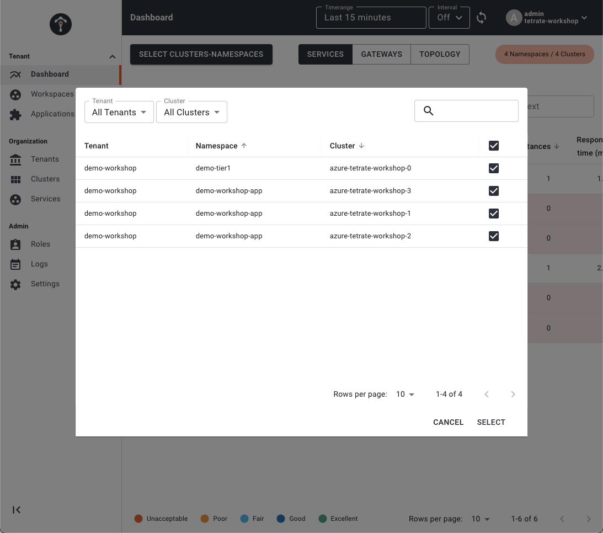
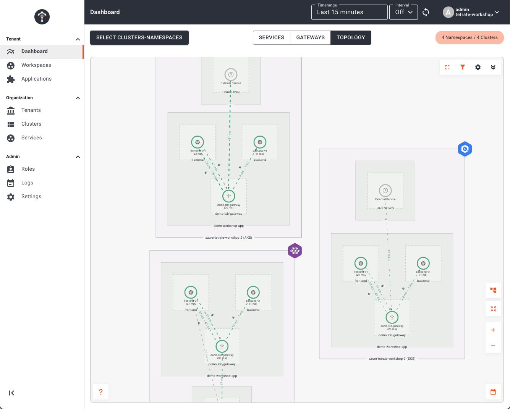
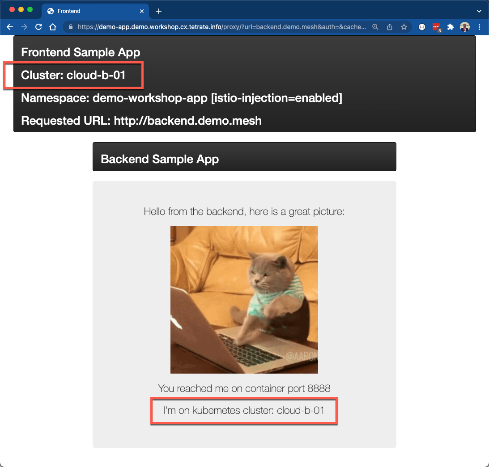
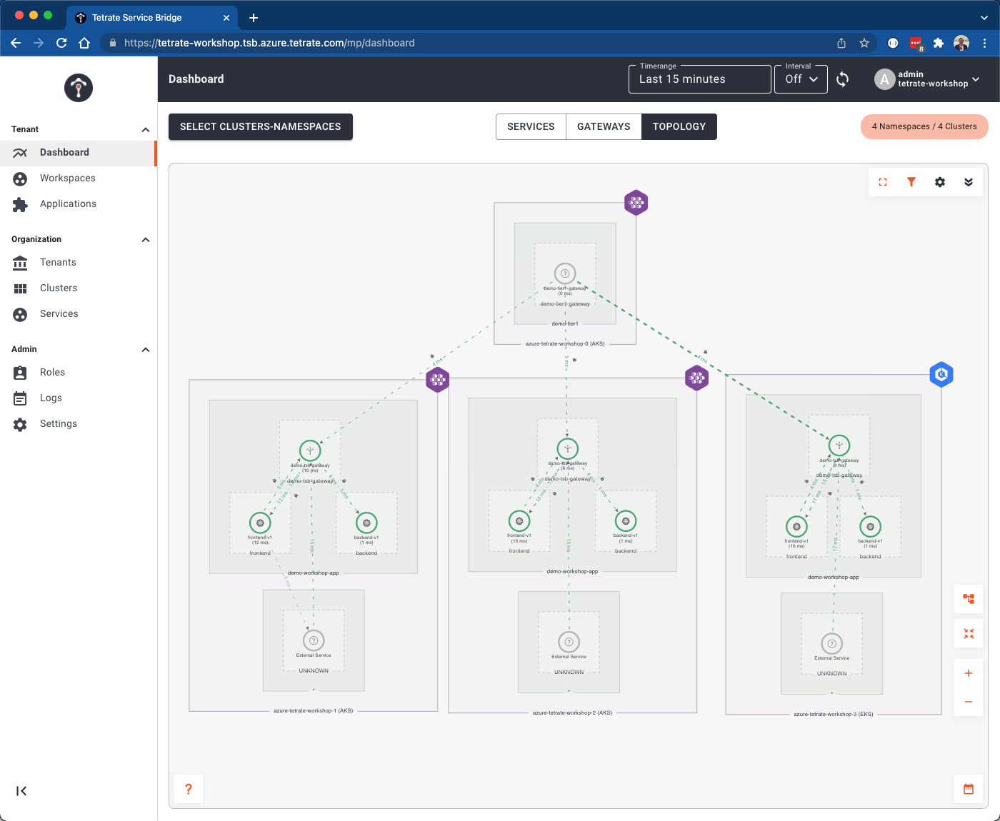

# Overview
Up until this point we have deployed our applications and setup multi-tenancy within TSB.  However, the applications are not accessible external to the Kubernetes clusters and they are not configured to take full advantage of the global service mesh.  Typically within an Istio service mesh, applications must be configured with `Gateways`, `VirtualServices`, `DestinationRules`, `ServiceEntries`, and even more custom `Istio` objects to control traffic.  TSB simplifies this greatly.

## Configuring Applications within TSB
As we ensured with our previous labs, prior to continuing ensure you have an environment variable in the shell you are using named `PREFIX`.  You will also want to ensure that your `tctl` CLI is targeted and logged into the TSB management plane.

```bash
# This should print the prefix assigned to you
echo Workshop Prefix: $PREFIX

# This should return your current TSB Tenant
tctl get tenant $PREFIX-workshop
```

We will be creating nearly identical configurations in all 3 of our application Kubernetes clusters.  Using the `tctl apply` command create a Tetrate `IngressGateway` for each cluster.  Under the covers TSB will create all the needed service mesh configuration objects. Execute the following apply commands and then we'll inspect the configuration a bit further

```bash
envsubst < 03-app-ingress/01-tsb-cloud-a-01.yaml | tctl apply -f -  
envsubst < 03-app-ingress/02-tsb-cloud-a-02.yaml | tctl apply -f -  
envsubst < 03-app-ingress/03-tsb-cloud-b-01.yaml | tctl apply -f -  
```

Let's dig into what what was actually configured via TSB and within the global service mesh.  We will use the Cloud A 01 Cluster.  Inspect the file `03-app-ingress/01-tsb-cloud-a-01.yaml`

- The first item you'll note is that a set of metadata is provided that maps this `IngressGateway` object to all the relevant multi-tenancy objects; Tenants, Workspaces, and Groups.  If we had configured this via the web UI that metadata would have been picked up automatically.

```yaml
---
apiVersion: gateway.tsb.tetrate.io/v2
kind: IngressGateway
metadata:
  name: app-gateway
  group: frontend-gw-01
  workspace: workshop-app
  tenant: $PREFIX-workshop
  organization: visa
...  
```

- Secondly, you'll note there is a small `workloadSelector` fragment that will map the service mesh gateway objects to the deployed gateway(s), which are Envoy proxies.  
```yaml
...
workloadSelector:
  namespace: $PREFIX-workshop-app
  labels:
    app: $PREFIX-tsb-gateway
...  
```

You can easily verify that this maps to the correct Envoy gateway pod using a simple `kubectl command`.  Ensure your kubecontext is pointed at the cloud A 01 cluster.  Take note of the matching `app=` label, which is what is used in the workload selector we reviewed above.

```bash
kubectl --context cloud-a-01 get po -n $PREFIX-workshop-app -l istio=ingressgateway --show-labels
```

```bash
NAME                                READY   STATUS    RESTARTS   AGE   LABELS
demo-tsb-gateway-667b486b45-b24xb   1/1     Running   0          20m   app=demo-tsb-gateway,install.operator.istio.io/owning-resource=unknown,istio.io/rev=default,istio=ingressgateway,operator.istio.io/component=IngressGateways,pod-template-hash=667b486b45,service.istio.io/canonical-name=demo-tsb-gateway,service.istio.io/canonical-revision=latest,sidecar.istio.io/inject=false
```

- Next, you'll see the definition of the ingress endpoints for both the frontend and backend applications.  Pay particular note to the FQDNs at which the services are exposed.  The frontend application is exposed at a FQDN that is publicly resolvable.  Additionally, it is exposed on 443 for TLS along with a valid certificate specified.  Conversely, the backend is exposed via a FQDN that is not public, `backend.$PREFIX.mesh`.  This is because it is for *internal mesh traffic* and will only be resolvable by services within the global mesh.  Additionally, an external certificate for TLS communication is not necessary as the global mesh will automatically encrypt all inter-mesh traffic and secure via mTLS.   

Now lets test our applications!

## Testing Our Applications
We have deployed our services across 3 clusters -- 2 clusters in cloud A and 1 cluster in cloud B.  The following table lists the internal and/or external endpoints of all the services.  `$PREFIX` should be replaced with value of your PREFIX env variable you have been using throughout this workshop.

| Cluster      | Application | External Address | Internal Address |
| ----------- | ----------- | ----------- | ----------- |
| Cloud A - 01 | frontend | demo-app.cloud-a-01.$PREFIX.workshop.cx.tetrate.info        | N/A        |
|  | backend        | N/A        | backend.$PREFIX.mesh        |
| Cloud A - 02 | frontend        | demo-app.cloud-a-02.$PREFIX.workshop.cx.tetrate.info        | N/A        |
|  | backend        | N/A        | backend.$PREFIX.mesh       |
| Cloud B - 01 | frontend        | demo-app.cloud-b-01.$PREFIX.workshop.cx.tetrate.info       | N/A        |
|  | backend        | N/A        | backend.$PREFIX.mesh      |

Open your browser and navigate to https://demo-app.cloud-a-01.$PREFIX.workshop.cx.tetrate.info.  Make sure you replace $PREFIX in the URL with your prefix value.  The application should display in your browser.  Enter the internal address for the backend service -- `backend.$PREFIX.mesh`.  Again, replacing $PREFIX with your actual enviroment prefix.  This will cause the frontend microservice to call to the backend microservice over the service mesh and return the display the response via the frontend app.  

- Next lets view our application metrics within the TSB UI.  Log into the TSB UI by opening another browser tab and navigating to `https://visa.poc-tsb.azure.tetrate.com/admin/login`.  Select `Log in with OIDC` and when prompted enter your TSB credentials.  These can be found in the shared Google sheet that you obtained jumpbox information from.  Once logged in, you will be routed to the Dashboard view.  You'll need to select the clusters you want displayed; in our case we want to see information about services in all clusters.  Click the `SELECT CLUSTERS-NAMESPACES` button and select all clusters and namespaces.  When we installed our applications in the previous lab, we also installed a traffic generator.  This is the reason when we begin utilizing the UI we see a steady stream of traffic flowing.



Then click the Topology tab in the top center portion of the UI.  This will display the topology of all microservices and the communciation flows between the service, even across clusters.



## Deploying a Tier 1 Edge Load Balancer
Now that we have deployed and configured our applications in all 3 clusters we can setup a `Tier 1 Gateway`, which is an Ingress Gateway that understands the multi-cluster topology of an application and is able to load balance across instances of the application regardless of what cloud, region, or cluster they are running in.  During this last setup we will target a new cluster, which has the sole purpose of hosting Tier 1 Gateways.  

- First we need to apply the TSB IngressGateway configuration for the `Tier1Gateway` in the Tier 1 cluster.  Use the `tctl apply` command create objects.  As with our other lab scenarios, under the covers TSB will create all the needed service mesh configuration objects. Execute the following apply command and then we'll inspect the configuration a bit further.

```bash
envsubst < 03-app-ingress/04-tsb-tier1.yaml | tctl apply -f - 
```

Inspect the file `03-app-ingress/04-tsb-tier1.yaml`.  You'll see the expected metadata section that maps to a tenant, workspace, etc and also the workload selector that delivers the config to the deployed Istio Ingress Gateway.  The most important part is the configuration that exposes an `externalServer` with a FQDN (`demo-app.$PREFIX.workshop.cx.tetrate.info`) with proper TLS termination.

```yaml
externalServers:
  - hostname: demo-app.$PREFIX.workshop.cx.tetrate.info
    name: demo-app
    port: 443
    tls:
      mode: SIMPLE
      secretName: frontend-certs
```

What you do not see is any configuration that maps this external endpoint configuration to the clusters in which our application services run.  This is because the Global Service Mesh is intelligent enough to automatically discover and link up upstream services that match this endpoint.  These upstream services are configured in the clusters via the config we've already applied.  Take a look at `03-app-ingress/01-tsb-cloud-a-01.yaml`.

You'll find an ingress configuration for `frontend-internal` at the same FQDN.  This also contains the routing rules that map the request to Kubernetes service for our frontend service.  DNS that is available externally for `demo-app.$PREFIX.workshop.cx.tetrate.info` maps to the Tier1 Gateway.  So this local gateway is only routable and discoverable *internally* to the mesh using that domain.  All traffic flowing from the Tier1 cluster upstream to the clusters with the application services will be encrypted and secured via mTLS and transit on a single port, 15443.

```yaml
http:
  - name: frontend-internal
      port: 443
      tls:
        mode: SIMPLE
        secretName: frontend-certs
      hostname: demo-app.$PREFIX.workshop.cx.tetrate.info
      routing:
        rules:
          - route:
              host: "$PREFIX-workshop-app/frontend.$PREFIX-workshop-app.svc.cluster.local"
              port: 8888
```

- To test, open a browser and navigate to https://demo-app.$PREFIX.workshop.cx.tetrate.info (replace $PREFIX with your actual prefix).  Enter the internal address for the backend service -- `backend.$PREFIX.mesh`.  You should see the result when the frontend application calls to the backend microservce.  *Refresh the page about a dozen times* to ensure you have traffic load balanced across all Kubernetes clusters.  As you refresh the page, take particular note of the output from the `Cluster` field displayed in the frontend and the cluster that responds when the backend is invoked (this is indicated by the message: `I'm on kubernetes cluster: <CLUSTER NAME>`).  They should always be the same.  This is because, even though the backend service is available on all cluster, the global mesh is inteillgent enough to route the request to the most optimial endpoint.  Assuming no failures, this will *Always* be the local version.



- Lets see how Global Load Balancing w/ locality is visualized in the TSB UI.  Return to your browser window containing the TSB and navigate to *Dashboard* on the left menu and then select *Topology*.  Take note of the fact that the Tier1 Gateway is loadbalancing requests across all 3 clusters.  However, once a request arrives in a local cluster it always favors local instances of dependent microservices.  By enabling 'traffic' and 'mTLS' visualization in the settings menu (upper right hand gear icon) you're able to see that all traffic, once it arrives at the Tier1, is secured via mTLS regardless of the destination in the mesh. 



How does this work?  We'll explore the configuration pushed out to our *cloud A 01* cluster, which is where the frontend application you tested with is running.  You can view the global config that was automatically distributed across the mesh by executing the following command to show `ServiceEntries` that were created.  This configuration instructs the frontend's service mesh sidecar how to connect to the backend running on a different cluster.

```bash
kubectl --context cloud-a-01 describe serviceentries.networking.istio.io -n xcp-multicluster gateway-backend-$PREFIX-mesh
```

```bash
...
Spec:
  Endpoints:
    Address:  20.99.193.216
    Labels:
      Network:                     global
      security.istio.io/tlsMode:   istio
      xcp.tetrate.io/cluster:      azure-tetrate-workshop-1
      xcp.tetrate.io/hops:         0
      xcp.tetrate.io/serviceType:  remoteGateway
    Locality:                      westus2
    Ports:
      Http:   15443
    Address:  172.40.232.80
    Labels:
      security.istio.io/tlsMode:   istio
      xcp.tetrate.io/cluster:      azure-tetrate-workshop-2
      xcp.tetrate.io/hops:         0
      xcp.tetrate.io/serviceType:  localGateway
    Locality:                      eastus2
    Ports:
      Http:   15443
    Address:  aac94e566ffdb434dbc68d1a9d391dcd-1661016363.us-east-2.elb.amazonaws.com
    Labels:
      Network:                     global
      security.istio.io/tlsMode:   istio
      xcp.tetrate.io/cluster:      azure-tetrate-workshop-3
      xcp.tetrate.io/hops:         0
      xcp.tetrate.io/serviceType:  remoteGateway
    Locality:                      us-east-2
    Ports:
      Http:  15443
  Export To:
    *
  Hosts:
    backend.demo.mesh
  Location:  MESH_INTERNAL
  Ports:
    Name:      http
    Number:    80
    Protocol:  HTTP
  Resolution:  DNS
...
```
You'll see three possible endpoints to route the request.  However, only one is flagged as a `localGateway`; the other 2 are `remoteGateway` entries.  Assuming there are no failures in the local cluster, the mesh is intelligent enough to route to the localGateway.

However, what happens when there is a failure?  Lets break some stuff!!!