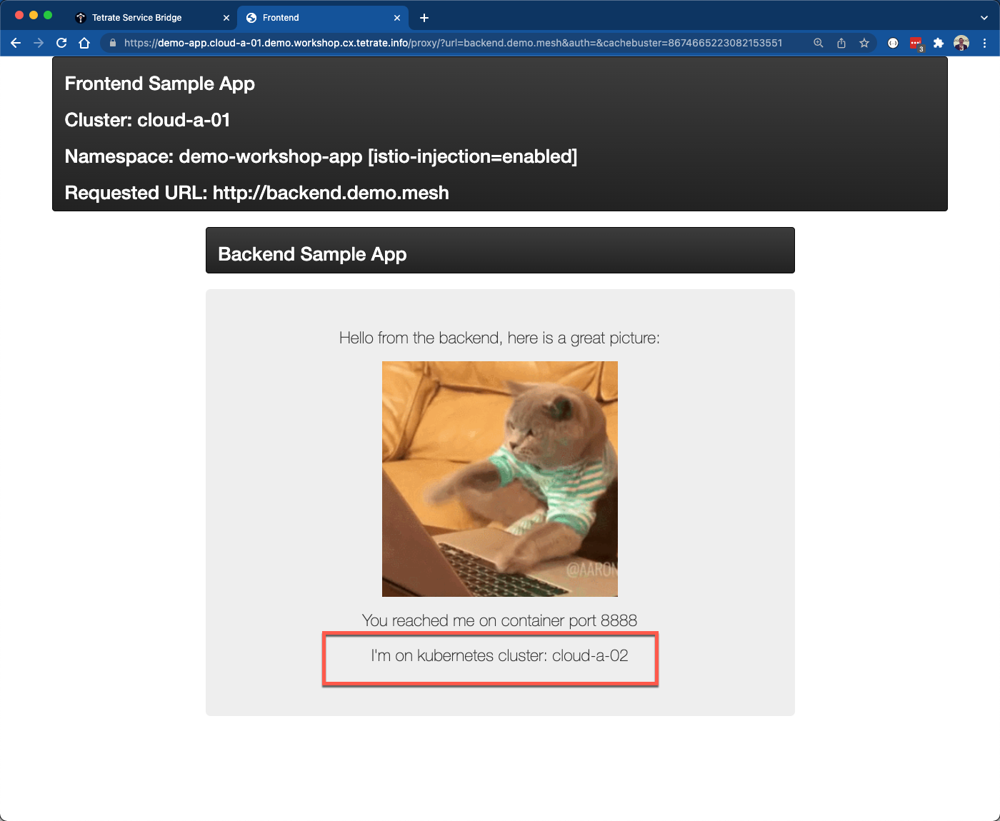
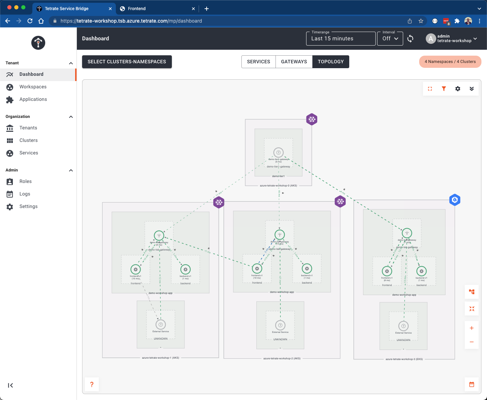

# Overview
When failures occur the mesh will automatically shift traffic to other services that are healthy, typically in a different cluster, region, or cloud.  Whats more, we have the ability to shape how traffic fails over.  In our environment we have services spread across 2 clouds.  It probably makes sense that when services failover, we try to keep traffic within a cloud providers.  Lets ensure that when services fail within Cloud A 01, we fail over to Cloud A 02 (rather than Cloud B 01).


## Automatic Failover
- We will be creating default settings within our workspace to control failover.  However, we could also set idenitical configuration at a global level.  Using the `tctl apply` command create a Tetrate `WorkspaceSetting`.  Under the covers TSB will create all the needed service mesh configuration objects to shape our traffic.

```bash
envsubst < 04-app-failover/01-workspace-setting.yaml | tctl apply -f -  
```

Let's dig into what what was actually configured.  Inspect the file `04-app-failover/01-workspace-setting.yaml` 

- The first item you'll note, other than the metadata mapping this to the relevant workspace, is that we are configuring a few resiliency options that will control timeouts, retries, etc.  This will apply to all sidecars within this workspace.

```yaml
...
defaultTrafficSetting:
  resilience:
    httpRequestTimeout: "1s"
    httpRetries:
    attempts: 3
    perTryTimeout: "1s"
    retryOn: 5xx
    circuitBreakerSensitivity: HIGH
...  
```

- Next, and more importantly, you'll note there is a small `regionalFailover` fragment.  Without this configuration, when a failure occurs traffic would be load balanced across any available endpoints.  With this configuration we are ensuring we keep traffic with Azure, which we can tell because of the format of the region names.  
```yaml
...
regionalFailover:
  - from: eastus2    
    to: westus2
...  
```


- Let's simulate a *failure* of the backend service.  We'll do this by scaling the replicas of the deployment to zero in our `cloud-a-01` cluster.  Use kubectl to scale the backend deployment to zero:

```bash
kubectl --context cloud-a-01 scale deployment backend --replicas 0 -n $PREFIX-workshop-app
```

Wait a few seconds for the pods to completely terminate.  Go back to the browser window that is open to the our demo application deployed in the cloud-a-01 cluster (`https://demo-app.cloud-a-01.$PREFIX.workshop.cx.tetrate.info/`).   Enter the internal address for the backend service -- `backend.$PREFIX.mesh`.  This will cause the frontend microservice to call to the backend microservice over the service mesh and return the display the response via the frontend app.  You'll note you don't get any errors.  Additionally, though the `Cluster` field displayed in the frontend should be `cloud-a-01`, you'll note that you get a response from the backend running clouster `cloud-a-02`.  This is because immediately the mesh identifies the service that is unavailable and shifts requests to the details service to the healthy instances.  If we were to experience a complete outage for our backend in Cloud A, the backend traffic would be shifted to Cloud B.



- Let's see how this has changed our topology view.  Going back to the TSB UI, refresh the browser that has the TSB application open.  You'll now see a line representing traffic flowing from the frontend within the cloud A 01 cluster to the gateway, and subsequently the backend service, in the cloud A 02 cluster.  



- We can use a utility that ships with the Istio CLI to inspect the reported endpoints within any given sidecar proxy.  Lets take a look at what we see reported for our frontend pod.  Execute the following script:

```bash
kubectx cloud-a-01 
export POD_NAME=$(kubectl get po -n $PREFIX-workshop-app -l app=frontend --output=jsonpath={.items..metadata.name})
istioctl proxy-config endpoints $POD_NAME.$PREFIX-workshop-app --cluster "outbound|80||backend.$PREFIX.mesh" 
```

Note we have one failed endpoint.
```bash
ENDPOINT                STATUS      OUTLIER CHECK     CLUSTER
172.40.232.80:15443     HEALTHY     FAILED            outbound|80||backend.demo.mesh
18.119.6.151:15443      HEALTHY     OK                outbound|80||backend.demo.mesh
18.218.83.237:15443     HEALTHY     OK                outbound|80||backend.demo.mesh
20.99.193.216:15443     HEALTHY     OK                outbound|80||backend.demo.mesh
3.128.223.133:15443     HEALTHY     OK                outbound|80||backend.demo.mesh
```

- Prior to continuing with the workshop, lets bring Cloud A 01 back into a healthy state:

```bash
kubectl --context cloud-a-01 scale deployment backend --replicas 1 -n $PREFIX-workshop-app
```