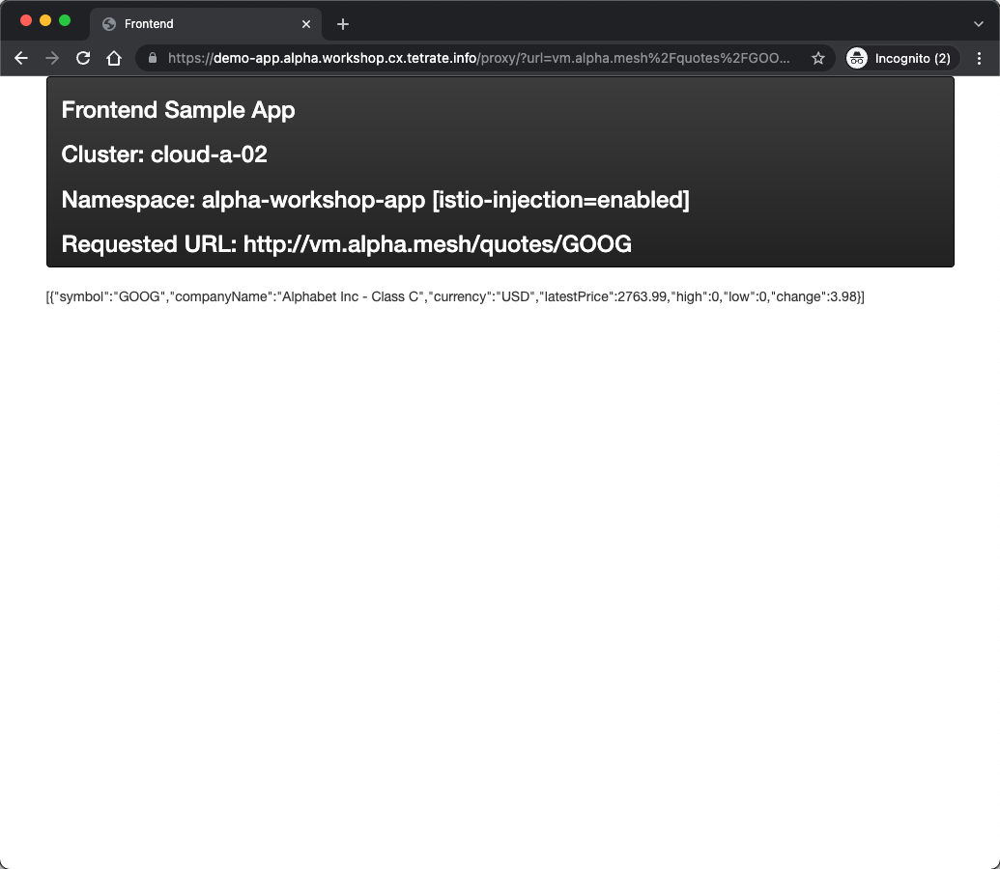
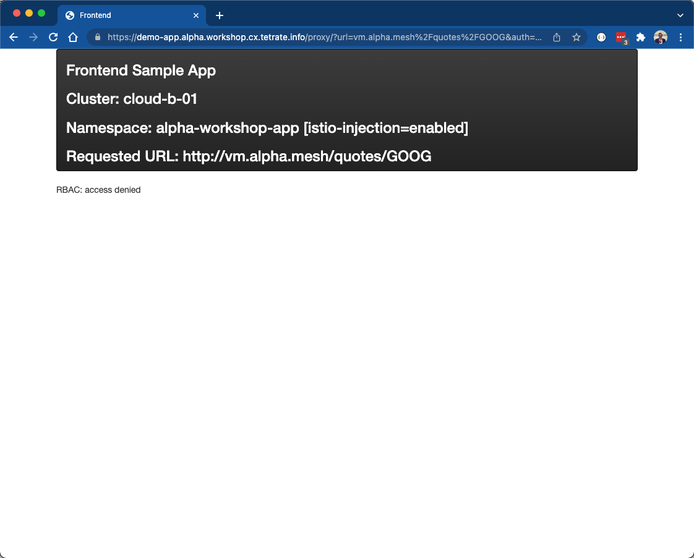

# Overview
Up until this point we configured both internal and external access to our demo application as well as internal access to the market data application.  However, we have configured ZERO security policy, meaning any pod running in our kubernetes clusters can access any service.  We can test this out using a curl pod that is in a namespace that is not Istio-enabled, meaning that it will not be part of the service mesh:

```bash
kubectl --context cloud-a-01 get ns -L istio-injection
kubectl --context cloud-a-01 run $PREFIX-shell -n default --rm -i --tty --image nicolaka/netshoot --env="PREFIX=$PREFIX" -- /bin/bash
```

Once your pod starts up and you get a bash command line execute a curl command to the market data service:

```bash
curl -i quotes.$PREFIX-quotes:8080/quotes/GOOG
```

We were able to send a plain HTTP request to the service and our request was trusted simply because we are in the same kubernetes cluster.  That is a bad thing!  We will now add some security policy to our Market Data service:

1. We will add strict mTLS to services running in the Market Data workspace.  In other words, we will add Authentication policy based on the service identity issued by the mesh.
2. We will add authorization policy based on the service identities issued by the mesh.

If you haven't done so already, exit out of the temporary curl pod by typing `exit`.

# Configure Service to Service Authentication (strict mTLS)
Within TSB establishing default policy for AuthN/Z is a trivial task. We will create a default WorkspaceSetting that will apply to the Market Data workspace using tctl apply:

```bash
envsubst < 06-app-security-s2s/01-default-policy.yaml | tctl apply -f -   
```

Inspect the file `06-app-security-s2s/01-default-policy.yaml`. As you may expect, the metadata section contains the names and IDs that map the WorkspaceSetting to the application's workspace. However, the important piece is the defaultSecuritySetting

```yaml
defaultSecuritySetting:
  authenticationSettings:
    trafficMode: REQUIRED
```

This will configure all services deployed to any cluster that is part of the Market Data workspace to require strict mTLS authentication.  We can now test using the same curl pod command:

```bash
kubectl --context cloud-a-01 run $PREFIX-shell -n default --rm -i --tty --image nicolaka/netshoot --env="PREFIX=$PREFIX" -- /bin/bash
```

Once your pod starts up and you get a bash command line execute the same curl command to the market data service:

```bash
curl -i quotes.$PREFIX-quotes:8080/quotes/GOOG
```

The message `Recv failure: Connection reset by peer` is indiciative of our request being rejected because we did not provide a valid client certificate.

# Configure Service to Service Authorization
Lets verify that the inter-mesh traffic is still functioning between our demo-app, which has been the frontend app we have been utilizing in a browser, and the market data service.  Open a browser and navigate to https://demo-app.cloud-a-01.$PREFIX.workshop.cx.tetrate.info (replace $PREFIX with your actual prefix and make sure you're using https not http). In the Backend HTTP URL field enter the following url, which will invoke the market data service: `quotes.$PREFIX-quotes:8080/quotes/GOOG` (again, replace $PREFIX with your actual prefix). We should see a response from either our VM backend or the pod, since our traffic is load balanced between the 2.  This is still functional because it is traffic within the mesh and the demo-app frontend is able to present a valid service identity in the form of a client ceritificate.  



As before, it is a trivial task to fruther lock down our servic by setting Authorization policy, in addition to simply authenticating client TLS certificates. We will update a default WorkspaceSetting that will apply to the Market Data workspace using tctl apply:

```bash
envsubst < 06-app-security-s2s/02-default-policy-authz.yaml | tctl apply -f -   
```

Inspect the file `06-app-security-s2s/02-default-policy-authz.yaml`. We have made a minor update to the defaultSecuritySettings specify an authorizationSetting, in addition to authenticationSetting.

```yaml
defaultSecuritySetting:
  authenticationSettings:
    trafficMode: REQUIRED
  authorization:
    mode: WORKSPACE
```

This will restrict service to service authorization to only service identities that are part of the same workspace.  Since the Demo App frontend is part of different workspace (Demo App workspace) it will receive an unauthorized message (and a HTTP 403 Response code).  Refresh the browser window of the frontend app and you will see the error.



We could also verify this by looking at the logs for network connections that were outbound from the Frontend app Envoy proxy:

```bash
kubectx cloud-a-01
export POD_NAME=$(kubectl get po -n $PREFIX-workshop-app -l app=frontend --output=jsonpath={.items..metadata.name})
kubectl --context cloud-a-01 -n $PREFIX-workshop-app logs $POD_NAME istio-proxy | grep 'v1/quotes'
```
```bash
[2022-02-17T15:13:50.963Z] "GET /quotes/GOOG HTTP/1.1" 403 - via_upstream - "-" 0 19 0 0 "-" "Go-http-client/1.1" "43d362b4-8b34-435a-a6f4-05cb16aee490" "quotes.free-quotes:8080" "172.41.0.20:8080" outbound|8080||quotes.free-quotes.svc.cluster.local 172.41.0.14:52324 172.40.25.205:8080 172.41.0.14:42538 - default
```

While this is a great step forward, we still have an implicit trust that any service running within our workspace is authorized to invoke our market data service.  Imagine the scenario of a 3 tier application comprised of a web frontend, backend business logic, and a relational database.  We may not want the frontend to be able to communicate directly with the database.  It is a best practice to be as explicit as possible with respect to servce to service authorization.  

Lets further restrict our workshop environment to ensure that *only* the ingress gateway can communicate with the quotes service within the Market Data workspace.  First, lets validate that any pod within the workspace, which is limited to the `$PREFIX-quotes` can still communicate with the service.  We'll once again test this using a helper curl pod:

```bash
kubectl --context cloud-a-01 run $PREFIX-shell -n $PREFIX-quotes --rm -i --tty --image nicolaka/netshoot --env="PREFIX=$PREFIX" -- /bin/bash
```

Once your pod starts up and you get a bash command line execute the same curl command to the quotes service, which is running in the same namespace:

```bash
curl -i quotes:8080/quotes/GOOG
```

You'll see that that this call was successful.  Exit out of the shell.  Lets apply the correct policy to restrict communication to *only* the ingress gateway. 


```bash
envsubst < 06-app-security-s2s/03-policy-authz.yaml | tctl apply -f -   
```

Inspect the file `06-app-security-s2s/03-policy-authz.yaml`. We have made one minor update to the defaultSecuritySettings to

```yaml
defaultSecuritySetting:
  authenticationSettings:
    trafficMode: REQUIRED
  authorization:
      mode: CUSTOM
      serviceAccounts:
        - $PREFIX-quotes/$PREFIX-tsb-quotes-gateway-service-account
```

This will restrict service to service authorization to only services that present the identity linked to the `$PREFIX-tsb-quotes-gateway-service-account`.  This is linked to the SPIFFE workload identity encoded in the x509 ceritifcate that is utilized by the sidecar proxy when making inter-mesh service calls.  Lets verify that our helper curl pod, which is a "rogue" pod, is now blocked:

```bash
kubectl --context cloud-a-01 run shell -n $PREFIX-quotes -i --tty --image nicolaka/netshoot --env="PREFIX=$PREFIX" -- /bin/bash
```

Once your pod starts up and you get a bash command line execute the same curl command to the quotes service, which is running in the same namespace:

```bash
curl -i quotes:8080/quotes/GOOG
```

Now our call is denied with a http 403 response code and message `RBAC: access denied`.  Exit out of the pod.  We can futher confirm why we saw this behavior by inspecting the mesh workload identities of both the helper curl pod and the ingress gateway.  we'll do this using the `istioctl` cli, which provides the ability to inspect certificates loaded into the Envoy proxy.

1. Inspect the workload identity that is utilized by the curl pod:

```bash
echo "Curl Workload Identity:"
istioctl proxy-config secrets shell.$PREFIX-quotes -o json | jq -r '.dynamicActiveSecrets[0].secret.tlsCertificate.certificateChain.inlineBytes' | base64 -d

# Output the certificate contents with openssl
istioctl proxy-config secrets shell.$PREFIX-quotes -o json | jq -r '.dynamicActiveSecrets[0].secret.tlsCertificate.certificateChain.inlineBytes' | base64 -d | openssl x509 -text -noout 
```

Note the SAN that contains the SPIFFEE identity.  This was rejected because it did not match the service account configured in the defaultSecuritySetting.  Since we didn't specify a service account out pod was associated with the default service account in the kubernetes namespace.

```bash
...
X509v3 Subject Alternative Name: critical
    URI:spiffe://cluster.local/ns/demo-quotes/sa/default
...
```

2. Inspect the workload identity that is utilized by the ingress gateway pod:

```bash
export POD_NAME=$(kubectl --context cloud-a-01 get po -n $PREFIX-quotes -l istio=ingressgateway --output=jsonpath={.items..metadata.name})
echo "Ingress Gateway Workload Identity:"
istioctl proxy-config secrets $POD_NAME.$PREFIX-quotes -o json | jq -r '.dynamicActiveSecrets[0].secret.tlsCertificate.certificateChain.inlineBytes' | base64 -d

# Output the certificate contents with openssl
istioctl proxy-config secrets $POD_NAME.$PREFIX-quotes -o json | jq -r '.dynamicActiveSecrets[0].secret.tlsCertificate.certificateChain.inlineBytes' | base64 -d | openssl x509 -text -noout
```

Note the SAN that contains the SPIFFEE identity matches the service account identity we configured in the defaultSecuritySettings

```bash
...
X509v3 Subject Alternative Name: critical
    URI:spiffe://cluster.local/ns/demo-quotes/sa/demo-tsb-quotes-gateway-service-account
...
```

- Seeing that we now have out Market Data service completely locked down, except for the ingress gateway, we now need to expose our service externally via the gateway.  We'll update the IngressGateway with a setting for external DNS resolution in addition to a TLS Certificate.

```bash
envsubst < 06-app-security-s2s/04-external-config.yaml | kubectl --context cloud-a-01 apply -f -   
```

Additionally, we'll update the mesh configuration to expose an external endpoint, which will be in addition to the internal endpoint of vm.$PREFIX.mesh, which will allow us to test the service as an external consumer.

```bash
envsubst < 06-app-security-s2s/05-mesh-config.yaml | tctl apply -f - 
```

Out service is now available from anywhere, a browser or curl command, outside the cluster.

```bash
curl -i https://quotes.$PREFIX.workshop.cx.tetrate.info/quotes/GOOG
```

*** Note - it may take about a minute to issue the TSL certificate for the public endpoint.  If you receive an error response to the curl command, verify that the TLS certificate has been issued, which will be indicated by the `Ready` field when retreiving the certificate using `kubectl`.  If `Ready = False`, wait a few more moments and check again.
```
kubectl --context cloud-a-01 -n $PREFIX-quotes get certificate
```

Next we will add request-level authentication and authorization based on JWT tokens.