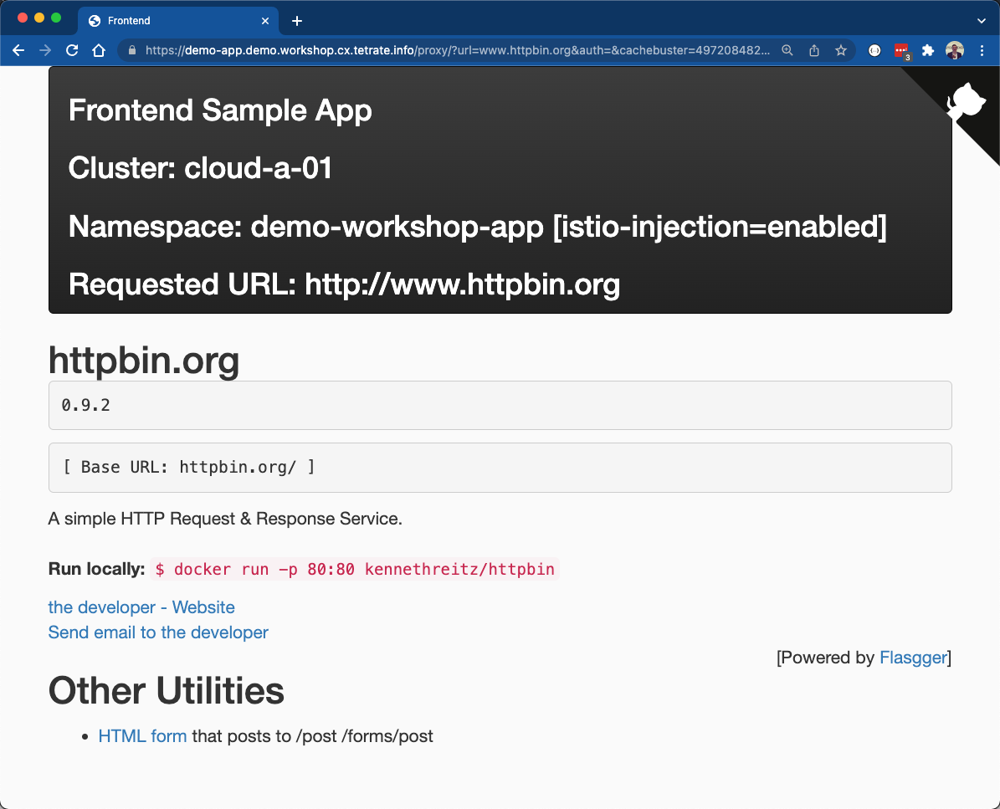
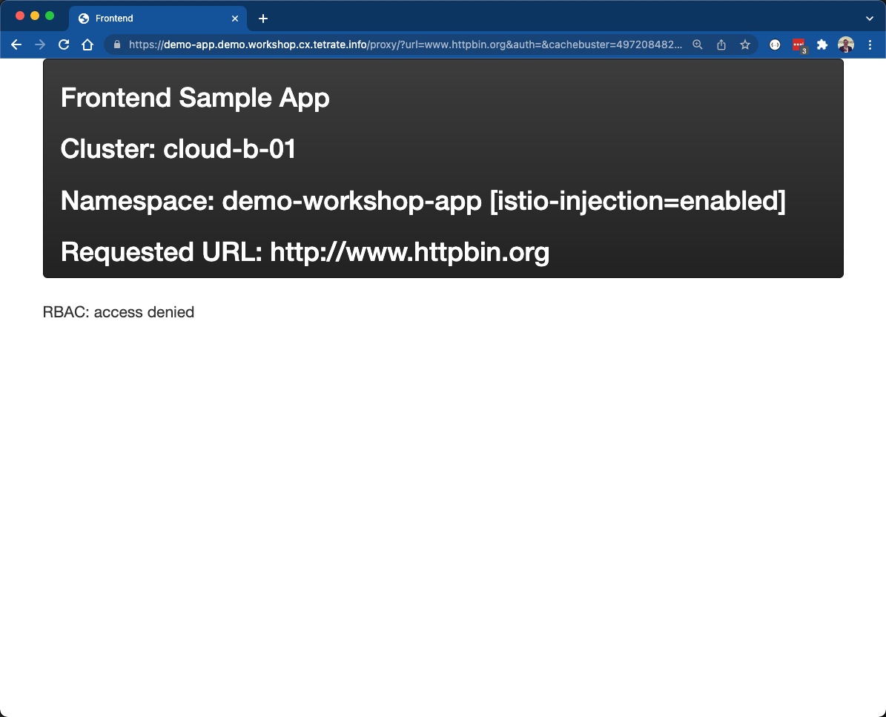

# Overview
Up to this point we have secured inbound communication to services within the mesh using workload idenitities and JWT tokens.  As a last step, we secure communication leaving the mesh to external endpoints.  We will secure and shape this traffic utilizing an `EgressGateway`, ensuring that external endpoints are allow-listed and that services making external requests present the proper workload identity that is allowed egress access from the mesh.

## Deploy Egress Gateway
We will create a new logical multi-tenancy object within the `Demo App` workspace.  The reason for this is typically a security team will *own* the policy for application egress.  Creating a logical group for egress policy allows us to apply granualr RBAC policy that will ensure that only the proper users can author this security-related portion of mesh policy.

1. First, we will update the `Demo App` workspace itself to include a `$PREFIX-security` namespace and then create a new Gateway Group named `App Egress` that will control configuration for that namespace and egress gateway.  Apply the configuration using `tctl apply`:

```bash
envsubst < 08-app-security-egress/01-egress-group.yaml | tctl apply -f -
```

2. Next we need to deploy the egress gateway into each kubernetes cluster using `kubectl apply`:

```bash
envsubst < 08-app-security-egress/02-egress-gw.yaml | kubectl --context cloud-a-01 apply -f - 
envsubst < 08-app-security-egress/02-egress-gw.yaml | kubectl --context cloud-a-02 apply -f - 
envsubst < 08-app-security-egress/02-egress-gw.yaml | kubectl --context cloud-b-01 apply -f - 
```

Take a look at the file, `08-app-security-egress/02-egress-gw.yaml`.  In here you'll see we created the new namespace -- `$PREFIX-security`, which maps to the namespace added to the `Demo App` workspace and managed by the `Gateway Group` created above.  Next you'll find a `EgressGateway` customer resource that controls the deployment of the Envoy Proxy that will be configured as the egress point.  It will also create a kubernetes service for discoverying the gateway.

```yaml
---
apiVersion: install.tetrate.io/v1alpha1
kind: EgressGateway
metadata:
  name: $PREFIX-cluster-egress
  namespace: $PREFIX-security
spec:
  kubeSpec:
    service:
      type: ClusterIP
```

You could verify the kubernetes objects are created using the following command.  You should see a Deployment/ReplicaSet/Pod that represents the `EgressGateway` along with a matching Service:

```bash
kubectl --context cloud-a-01 -n $PREFIX-security get all 
```

3. Lastly, add the TSB `EgressGateway` configuration to the Group we previously configured.  Use `tctl apply` to do this:

```bash
envsubst < 08-app-security-egress/03-egress-gw-tetrate.yaml | tctl apply -f - 
```
 If you open the file `08-app-security-egress/03-egress-gw-tetrate.yaml` you'll see the typical metadata that maps the tenant, workspace, and group.  In the `spec` for the configuration the selector maps the configuration to the pod(s) we deployed in the previous step.  We also have a list of authorizations, though at the moment it is empty.

 ```yaml
...
spec:
  workloadSelector:
    namespace: $PREFIX-security 
    labels:
      app: $PREFIX-cluster-egress
  authorization: []
 ```

## Configure Egress Rules
Prior to shaping our application's external traffic through the `EgressGateway` and configuring policy, first verify that the application functions without any egress mappings.  Open the Frontend Demo Application we've used throughout the workshop in a browser -- https://demo-app.$PREFIX.workshop.cx.tetrate.info/.  Replace $PREFIX with your environmental prefix.  In the Backend HTTP URL field enter www.httpbin.org.  You should see the httpbin webpage displayed within the application.



1. First, update the `WorkspaceSettings` for the Demo App workspace to utilize the egress gateway for traffic using `tctl apply`:

```bash
envsubst < 08-app-security-egress/04-egress-settings.yaml | tctl apply -f - 
```

Inspect the file `08-app-security-egress/04-egress-settings.yaml`.  This configuration builds off the settings we used in previous labs.  The notable addition is that an egress host is specified in the `defaultTrafficSetting` fragment

```yaml
spec:
  defaultTrafficSetting:
    egress:
      host: $PREFIX-security/$PREFIX-cluster-egress.$PREFIX-security.svc.cluster.local
```

2. Refresh your browser containing the Frontend Demo App pointing to www.httpbin.org a number times.  Once the configuration takes affect, you will being receiving an `HTTP 403` response code with a message of `RBAC: Access Denied`:



You will also see log messages in the egress gateway indicating the traffic to www.httpbin.org was denied.  If you initially don't see this message, refresh a few more times.  Since we are load balancing across all 3 clusters there is a chance the command below targeted a cluster that did not receive any egress traffic:

```bash
export POD_NAME=$(kubectl --context cloud-a-01 get po -n $PREFIX-security -l istio=egressgateway --output=jsonpath='{.items[].metadata.name}') 
echo Egress Pod: $POD_NAME
kubectl --context cloud-a-01 -n $PREFIX-security logs $POD_NAME 
```

```bash
[2022-02-14T16:45:29.210Z] "GET / HTTP/1.1" 403 - rbac_access_denied_matched_policy[none] - "-" 0 19 0 - "172.41.3.113" "Go-http-client/1.1" "37535f88-2e56-4d40-8ba3-bf0a119f5dac" "www.httpbin.org" "-" - - 172.41.3.116:15443 172.41.3.113:57500 outbound_.15443_._.demo-cluster-egress.demo-security.svc.cluster.local -
```

3. Lastly, add allow-list policy to the TSB `EgressGateway` previouslt configured using `tctl apply`:

```bash
envsubst < 08-app-security-egress/05-egress-gw-allow.yaml | tctl apply -f - 
```
 If you open the file `08-app-security-egress/05-egress-gw-allow.yaml` you'll see an ideintical `EgressGateway` configuration, except now there is an *authorization* configured.  This is allow-listing traffic to *.httpbin.org:

 ```yaml
...
spec:
  workloadSelector:
    namespace: $PREFIX-security 
    labels:
      app: $PREFIX-cluster-egress
  authorization:
  - to:
    - "*.httpbin.org"
 ```

Refresh your browser containing the Frontend Demo App pointing to www.httpbin.org a few more times.  Once the configuration takes affect you will once again be able to send traffic to www.httpbin.org:


Click the back button in the browser.  Enter a new public web address, such as google.com, into the HTTP Backend URL field and submit.  This new endpoint shoudl fail, because we have *only* allow-listed *.httpbin.org.


## Further Restricting with Workload Identity
We've created rules that apply to all applications running within the Demo App workspace.  However, we also have the ability to match egress authorization policy to specific workload identities.  A common real-world scenario for this would be restricting access to the "backend database", which lives outside of a the service mesh, to only the application(s) that require access and blocking all others -- such as a web fronend that does not need DB access.

1. Further update the `EgressGateway` policy to include custom identity authroizations using `tctl apply`:

```bash
envsubst < 08-app-security-egress/06-egress-gw-allow-sa.yaml | tctl apply -f - 
```
 If you open the file `08-app-security-egress/06-egress-gw-allow-sa.yaml` you'll see an small but important addition to the list of *authroziations* configured.  Now traffic to *.httpbin.org has been allow-listed only for workloads with the `secure-frontend` workload identity

 ```yaml
...
  authorization:
    - to:
      - "*.httpbin.org"
      from:
        mode: CUSTOM
        serviceAccounts:
        - $PREFIX-workshop-app/secure-frontend
 ```

Once again, go back in your browser and enter www.httpbin.org in the HTTP Backend Url field and submit.  Refresh your browser a few times.  Our application is now once again unauthorized to send traffic externally because it currently isn't using the `secure-frontend` identity.


2. Workload identities are assigned to kubernetes workloads based on `ServiceAccount`.  Using `kubectl`, create the secure-frontend `ServiceAccount` and then patch the frontend deployment to use this identity:

```bash
kubectl --context cloud-a-01 -n $PREFIX-workshop-app create sa secure-frontend
kubectl --context cloud-a-02 -n $PREFIX-workshop-app create sa secure-frontend
kubectl --context cloud-b-01 -n $PREFIX-workshop-app create sa secure-frontend

kubectl --context cloud-a-01 -n $PREFIX-workshop-app patch deployment frontend --patch-file 08-app-security-egress/07-app-patch.yaml --type merge
kubectl --context cloud-b-01 -n $PREFIX-workshop-app patch deployment frontend --patch-file 08-app-security-egress/07-app-patch.yaml --type merge
kubectl --context cloud-a-02 -n $PREFIX-workshop-app patch deployment frontend --patch-file 08-app-security-egress/07-app-patch.yaml --type merge
```

One last time, refresh your browser containing the Frontend Demo App pointing to www.httpbin.org a few more times.  Once the configuration takes affect you will once again be able to send traffic to www.httpbin.org:

