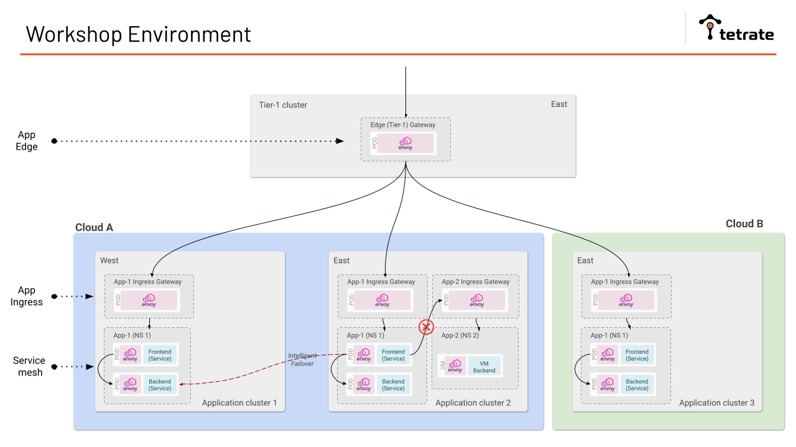
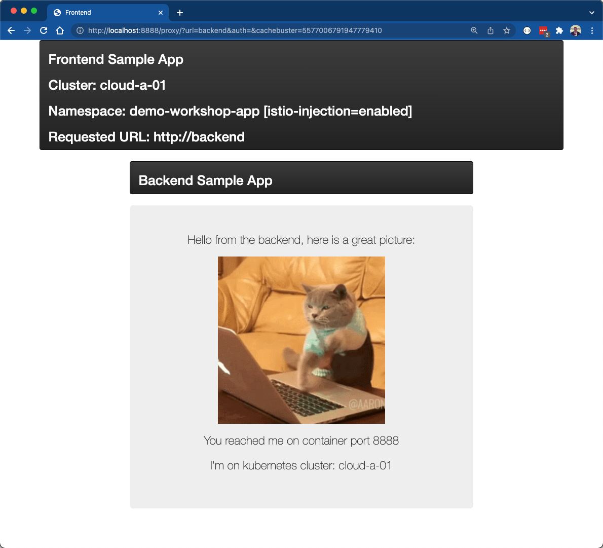
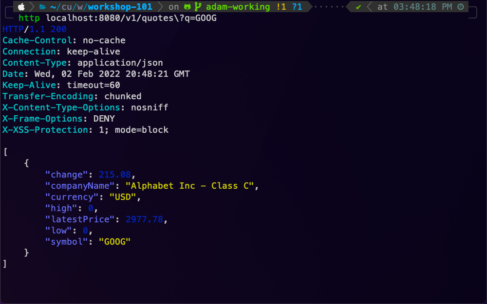

# Overview
This workshop provides Platform Operators, Application Developers, and Application Operators with hands on experience deploying and securing multi-cloud applications utilizing Tetrate Service Bridge. Included are presentations, demos, and hands on labs.

The target state infrastucture architecture is comprised of 4 Kubernetes clusters:

- 2 clusters are deployed into one cloud -- `Cloud A`.  Each cluster resides in a different region.  One of these clusters will have a VM onboarded into the mesh.
- 1 cluster is deployed in a different cloud -- `Cloud B`
- 1 cluster is deployed to a public cloud and services a Tier 1 Gateway, service as a global load balancer across all clusters and clouds.

## Workshop Agenda
1. Tetrate Introduction [Slides](https://docs.google.com/presentation/d/1T26gs7pWtNKp0qI6AT1gfQzDQhV8iNFb7n-dOC1chro/edit#slide=id.gb61fe1c3b5_0_0)
    1. [Lab - Environment Access](00-env-access/README.md)
2. Multi-tenancy [Slides](https://docs.google.com/presentation/d/1T26gs7pWtNKp0qI6AT1gfQzDQhV8iNFb7n-dOC1chro/edit#slide=id.g11476c09fec_0_0)
    1. [Lab - Multi-tenancy](01-multi-tenancy/README.md)
    2. [Lab - Application Deploy](02-app-deploy/README.md)
3. Application Config & Traffic Mgmt [Slides](https://docs.google.com/presentation/d/1T26gs7pWtNKp0qI6AT1gfQzDQhV8iNFb7n-dOC1chro/edit#slide=id.g11476c09fec_0_6)
    1. [Lab - Multi-region, Multi-cloud Application Ingress](03-app-ingress/README.md)
    2. [Lab - Application Failover](04-app-failover/README.md)
4. Legacy VM Integration [Slides](https://docs.google.com/presentation/d/1T26gs7pWtNKp0qI6AT1gfQzDQhV8iNFb7n-dOC1chro/edit#slide=id.g11476c09fec_0_12)
    1. [Lab - VM Onboarding](05-vm-integration/README.md)
5. Security Policy [Slides](https://docs.google.com/presentation/d/1T26gs7pWtNKp0qI6AT1gfQzDQhV8iNFb7n-dOC1chro/edit#slide=id.g11476c09fec_0_18)
    1. [Lab - Service to Service AuthN/Z](06-app-security-s2s/README.md)
    2. [Lab - End User JWT AuthN/Z](07-app-security-jwt/README.md)
    3. [Lab - Egress Policy](08-app-security-egress/README.md)
    

## Applications

During this workshop we will be modeling 2 different applications that allow for various architecture and security patterns that span Multi-Cluster and Multi-Cloud.

### Demo App
A simple frontend and backend application that allows simple testing of mesh networking and security.  This application spans all clouds and clusters, which will allow us to test intelligent routing and failover

### Market Data App
A simple application that retrieves market data.  This application is deployed to a VM in order to demonstrate VM onboarding and hybrid security models. 

## Preparing Workshop environment
Follow the instructions in the [workshop-101 branch of this repo.](https://github.com/tetrateio/workshop-environment/tree/workshop-101).
